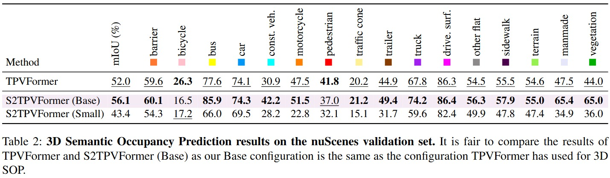
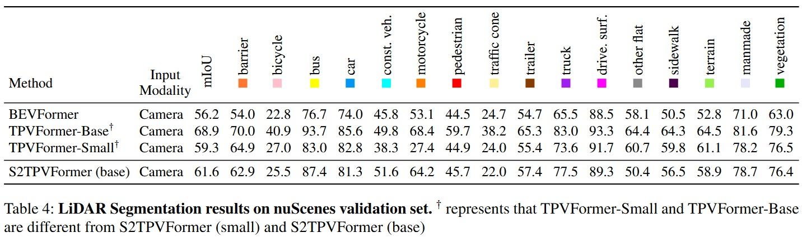

___
# S2TPVFormer: Improving 3D Semantic Occupancy Prediction using Spatiotemporal Transformers
___

> [Sathira Silva](https://scholar.google.com/citations?user=3ZiP8OYAAAAJ&hl=en)*, [Savindu Wannigama](https://scholar.google.com/citations?user=I6kUmVIAAAAJ&hl=en)\*, [Gihan Jayatilaka](https://scholar.google.com/citations?user=ZsJpIO8AAAAJ&hl=en) $\ddagger$, [Muhammad Haris Khan](https://scholar.google.com/citations?user=ZgERfFwAAAAJ&hl=en) $\ddagger$, [Prof. Roshan Ragel](https://scholar.google.com/citations?user=UTYj8usAAAAJ&hl=en) $\dagger$

\* Equal contribution $\dagger$ Project Supervisor $\ddagger$ Project Co-supervisor

### [Paper](https://arxiv.org/abs/2401.13785) | [Poster](https://cepdnaclk.github.io/e17-4yp-S2TPVFormer/assets/AAAI_S2TPVFormer_Poster.pdf)


## News
- [25/02/2025]: 🏆 Our paper received the best paper award at ML4AD Workshop 2025!
- [12/17/2024]: 🚀 Our paper got accepted at [ML4AD](https://ml4ad.github.io/) (AAAI '25) Workshop.
- [25/01/2024]: [Paper (preprint) released in arxiv](https://arxiv.org/abs/2401.13785)

## Abstract

Holistic understanding and reasoning in 3D scenes are crucial for the success of autonomous driving systems. The evolution of 3D semantic occupancy prediction as a pretraining task for autonomous driving and robotic applications captures finer 3D details compared to traditional 3D detection methods. Vision-based 3D semantic occupancy prediction is increasingly overlooked in favor of LiDAR-based approaches, which have shown superior performance in recent years. However, we present compelling evidence that there is still potential for enhancing vision-based methods. Existing approaches predominantly focus on spatial cues such as tri-perspective view (TPV) embeddings, often overlooking temporal cues. This study introduces S2TPVFormer, a spatiotemporal transformer architecture designed to predict temporally coherent 3D semantic occupancy. By introducing temporal cues through a novel Temporal Cross-View Hybrid Attention mechanism (TCVHA), we generate Spatiotemporal TPV (S2TPV) embeddings that enhance the prior process. Experimental evaluations on the nuScenes dataset demonstrate a significant **+4.1$%** of absolute gain in mean Intersection over Union (mIoU) for 3D semantic occupancy compared to baseline TPVFormer, validating the effectiveness of S2TPVFormer in advancing 3D scene perception.

## Introduction

Temporal reasoning holds equal importance to spatial reasoning in a cognitive perception system. In human perception, temporal information is crucial for identifying occluded objects and determining the motion state of entities. A system proficient in spatiotemporal reasoning excels in making inferences with high temporal coherence. While previous works emphasize the significance of temporal fusion in 3D object detection, earlier attempts at 3D Semantic Occupancy Prediction (3D SOP) often overlooked the value of incorporating temporal information. The current state-of-the-art in 3D SOP literature seldom exploits temporal cues. This is evident in [TPVFormer](https://github.com/wzzheng/tpvformer)’s SOP visualizations, where adjacent prediction frames lack temporal coherence as they rely solely on the current time step for semantic predictions. 

This work introduces S2TPVFormer, a variant of [TPVFormer](https://github.com/wzzheng/tpvformer), which utilizes a spatiotemporal transformer architecture inspired by [BEVFormer](https://github.com/fundamentalvision/BEVFormer), for dense and temporally coherent 3D semantic occupancy prediction. Leveraging TPV (Top View and Voxel) representation, the model’s spatiotemporal encoder generates temporally rich embeddings, fostering coherent predictions. The study proposes a novel **Temporal Cross-View Hybrid Attention** mechanism, enabling the exchange of spatiotemporal information across different views. To illustrate the efficacy of temporal information incorporation and the potential of the new attention mechanism, the research explores three distinct temporal fusion paradigms.

### Overview of our Contributions

To summarize, this work contributes in the following ways;

- We introduce S2TPVFormer, featuring a novel temporal fusion workflow for TPV representation, and demonstrate how CVHA facilitates the sharing of spatiotemporal information across the three planes.
- S2TPVFormer achieves significant improvements in the 3D SOP task on the nuScenes validation set, with a **+4.1%** mIOU gain over the baseline TPVFormer, highlighting that vision-based 3D SOP still has considerable potential for improvement.

## Architecture


## Model Configurations


## Quantitative Results





## Qualitative Results


## Related Projects

Our code is based on [TPVFormer](https://github.com/wzzheng/tpvformer) and [BEVFormer](https://github.com/fundamentalvision/BEVFormer). Many thanks to them!

## Team

- E/17/331 - SILVA H.S.C. - [e17331@eng.pdn.ac.lk](mailto:e17331@eng.pdn.ac.lk)
- E/17/369 - WANNIGAMA S.B. - [e17369@eng.pdn.ac.lk](mailto:e17369@eng.pdn.ac.lk)

## External Links

- [Department of Computer Engineering](http://www.ce.pdn.ac.lk/)
- [Faculty of Engineering](http://www.eng.pdn.ac.lk/)
- [University of Peradeniya](https://eng.pdn.ac.lk/)

## Citation

If this work is helpful for your research, please consider citing:
```
@article{silva2024s2tpvformer,
    title={A Spatiotemporal Approach to Tri-Perspective Representation for 3D Semantic Occupancy Prediction},
    author={Sathira Silva and Savindu Bhashitha Wannigama and Gihan Jayatilaka and Muhammad Haris Khan and Roshan Ragel},
    journal={arXiv:2401.13785},
    year={2024},
}
```
